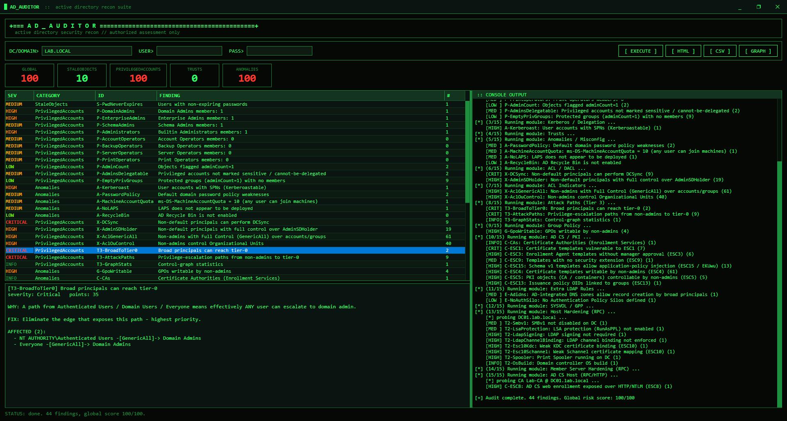

  

<h1 align="center">AD_AUDITOR</h1>

Набор для аудита безопасности Active Directory с интерфейсом в стиле терминала.

<a href="README.md">English version</a>

---

**AD_AUDITOR** — настольный инструмент для оценки защищённости домена Active Directory. Он подключается к каталогу, выполняет широкий набор проверок только на чтение, выставляет оценку риска и показывает результаты в интерфейсе в стиле хакерского терминала — включая интерактивный граф путей атак.

## Возможности

- **~110 проверок безопасности** по всей поверхности атаки Active Directory, сгруппированных в четыре домена риска (устаревшие объекты, привилегированные учётки, трасты, аномалии) с оценкой по каждому домену и общей оценкой риска (0–100).
- **Учётки и гигиена**: спящие и ни разу не использованные учётки, непросрочиваемые пароли, учётки без обязательного пароля, обратимое/DES-шифрование, устаревшие операционные системы, старые машинные пароли.
- **Привилегированные учётки**: состав всех чувствительных групп, администраторы, уязвимые к Kerberoasting и AS-REP roasting, возраст krbtgt и встроенного администратора, DnsAdmins, включённый Guest, широкие принципалы (например, Domain Users) внутри админских групп, скрытое членство через primaryGroupID.
- **Kerberos и делегирование**: неограниченное, ограниченное и ресурсное делегирование, Kerberoasting, AS-REP roasting.
- **Индикаторы атак через ACL**: кто, кроме администраторов, может захватить учётки/группы, сбросить пароль, изменить членство, записать Shadow Credentials, прочитать секреты LAPS/gMSA или управлять OU и привязкой GPO.
- **Службы сертификации (AD CS)**: мисконфигурации ESC1–ESC5, ESC7, ESC8, ESC9, ESC13, ESC15.
- **Трасты**: фильтрация SID, выборочная аутентификация, RC4, возраст пароля доверия.
- **Домен и политики**: парольная политика, точечные политики (PSO), квота на создание компьютеров, анонимный LDAP, покрытие LAPS, sIDHistory, сроки жизни билетов Kerberos, PrivExchange, Azure AD Connect, спуфинг ADIDNS, политики аутентификационных силосов, гигиена GPO и секреты в SYSVOL (cpassword, скрипты входа, Restricted Groups).
- **Закалка хостов** (по RPC, только чтение): SMB signing, SMBv1, уровень NTLM, WDigest, защита LSA, подпись и channel binding для LDAP, открытый Print Spooler и версия ОС — на контроллерах домена и рядовых серверах (опрос параллельный).
- **Граф путей атак (Тир 3)**: строит граф контроля и находит кратчайший путь эскалации привилегий от любой обычной учётки до уровня администратора домена, с цветовой раскраской и масштабируемой, перемещаемой визуализацией узлов и связей.
- **Отчёты**: самостоятельный HTML-отчёт и выгрузка в CSV для пайплайнов.

## Использование

1. Запустите приложение на машине, входящей в домен.
2. Оставьте поля **DC/DOMAIN**, **USER** и **PASS** пустыми, чтобы проверить текущий домен под своей учётной записью, либо укажите контроллер/имя домена и при необходимости `DOMAIN\user` + пароль.
3. Нажмите **EXECUTE** и наблюдайте за живым логом по мере работы модулей.
4. Изучите находки в таблице; выберите строку, чтобы увидеть затронутые объекты, причину важности и рекомендацию по исправлению.
5. Откройте вид **GRAPH** для путей атак или выгрузите результаты кнопками **HTML** / **CSV**.

## Требования и примечания

- Windows со средой выполнения .NET Framework 4.8.
- Для проверок каталога достаточно любой обычной доменной учётной записи — права администратора домена **не нужны**.
- Проверки закалки хостов читают реестр каждого сервера через службу **Remote Registry** и используют учётные данные **текущей Windows-сессии** (а не введённые в интерфейсе); если хост недоступен, такие проверки просто пропускаются.
- Все проверки выполняются **только на чтение**. Инструмент не изменяет каталог и не проводит активную эксплуатацию.

## Отказ от ответственности

Инструмент предназначен только для **авторизованной оценки безопасности собственной инфраструктуры**. Используйте его лишь там, где у вас есть явное разрешение.
